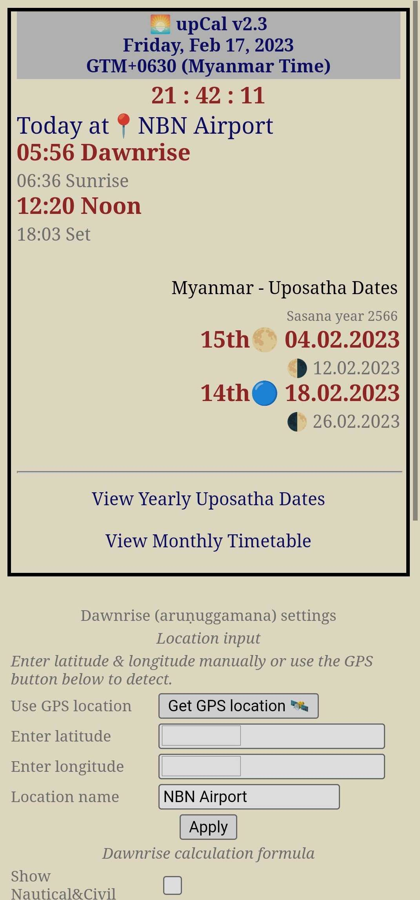

## Upcal Android


Upcal is an application that displays the Myanmar Uposatha calendar and Dawnrise time based on your location.

It's a handy tool for those who follow the Myanmar Upposatha calendar.

You can easily enter your location's latitude and longitude manually, or you can let the app detect your location automatically using GPS.

For iOS/iPadOS and the online web version of upCal, please visit [upcal repository](https://github.com/vpnry/upcal).

## Download

To download the latest version of the Upcal Android app, check [releases](https://github.com/vpnry/upcal-android/releases)





# Attributions

+ Android app Webview template

```markdown
Based on [slymax/webview](https://github.com/slymax/webview).
It was modified to allow JavaScript alerts, request GPS permission etc.
```


+ SunCalc (Vladimir Agafonkin)
```text

(c) 2011-2015, Vladimir Agafonkin
 SunCalc is a JavaScript library for calculating sun/moon position and light phases.
 https://github.com/mourner/suncalc
 
 
Copyright (c) 2014, Vladimir Agafonkin
All rights reserved.

Redistribution and use in source and binary forms, with or without modification, are
permitted provided that the following conditions are met:

   1. Redistributions of source code must retain the above copyright notice, this list of
      conditions and the following disclaimer.

   2. Redistributions in binary form must reproduce the above copyright notice, this list
      of conditions and the following disclaimer in the documentation and/or other materials
      provided with the distribution.

THIS SOFTWARE IS PROVIDED BY THE COPYRIGHT HOLDERS AND CONTRIBUTORS "AS IS" AND ANY
EXPRESS OR IMPLIED WARRANTIES, INCLUDING, BUT NOT LIMITED TO, THE IMPLIED WARRANTIES OF
MERCHANTABILITY AND FITNESS FOR A PARTICULAR PURPOSE ARE DISCLAIMED. IN NO EVENT SHALL THE
COPYRIGHT HOLDER OR CONTRIBUTORS BE LIABLE FOR ANY DIRECT, INDIRECT, INCIDENTAL, SPECIAL,
EXEMPLARY, OR CONSEQUENTIAL DAMAGES (INCLUDING, BUT NOT LIMITED TO, PROCUREMENT OF
SUBSTITUTE GOODS OR SERVICES; LOSS OF USE, DATA, OR PROFITS; OR BUSINESS INTERRUPTION)
HOWEVER CAUSED AND ON ANY THEORY OF LIABILITY, WHETHER IN CONTRACT, STRICT LIABILITY, OR
TORT (INCLUDING NEGLIGENCE OR OTHERWISE) ARISING IN ANY WAY OUT OF THE USE OF THIS
SOFTWARE, EVEN IF ADVISED OF THE POSSIBILITY OF SUCH DAMAGE.
```


+ MMCal (Yan Naing Aye)

```text

Description: Modern Myanmar Calendrical Calculations

WebSite: https://yan9a.github.io/mcal/
MIT License (https://opensource.org/licenses/MIT)
Copyright (c) 2018 Yan Naing Aye

Doc: http://cool-emerald.blogspot.com/2013/06/algorithm-program-and-calculation-of.html


MIT License

Copyright (c) 2018 Yan Naing Aye

Permission is hereby granted, free of charge, to any person obtaining a copy
of this software and associated documentation files (the "Software"), to deal
in the Software without restriction, including without limitation the rights
to use, copy, modify, merge, publish, distribute, sublicense, and/or sell
copies of the Software, and to permit persons to whom the Software is
furnished to do so, subject to the following conditions:

The above copyright notice and this permission notice shall be included in all
copies or substantial portions of the Software.

THE SOFTWARE IS PROVIDED "AS IS", WITHOUT WARRANTY OF ANY KIND, EXPRESS OR
IMPLIED, INCLUDING BUT NOT LIMITED TO THE WARRANTIES OF MERCHANTABILITY,
FITNESS FOR A PARTICULAR PURPOSE AND NONINFRINGEMENT. IN NO EVENT SHALL THE
AUTHORS OR COPYRIGHT HOLDERS BE LIABLE FOR ANY CLAIM, DAMAGES OR OTHER
LIABILITY, WHETHER IN AN ACTION OF CONTRACT, TORT OR OTHERWISE, ARISING FROM,
OUT OF OR IN CONNECTION WITH THE SOFTWARE OR THE USE OR OTHER DEALINGS IN THE
SOFTWARE.

```

## Misc dev

+ Reduce screenshot files:

```bash
jpegoptim --size=150k ./*.jpg

```

+ gh CLI release

```bash

# Draft release, upcal_v2.2.0.apk must present

gh release create v2.2.0 --title "Upcal v2.2.0" --notes "Click **> Assets** and download the apk file." upcal_v2.2.0.apk --draft

# Then login github web, check and publish
# Can publish directly by removing the --draft option

```
